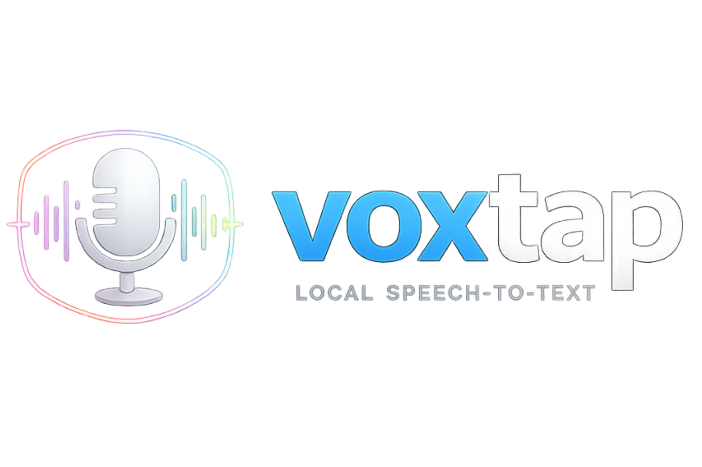
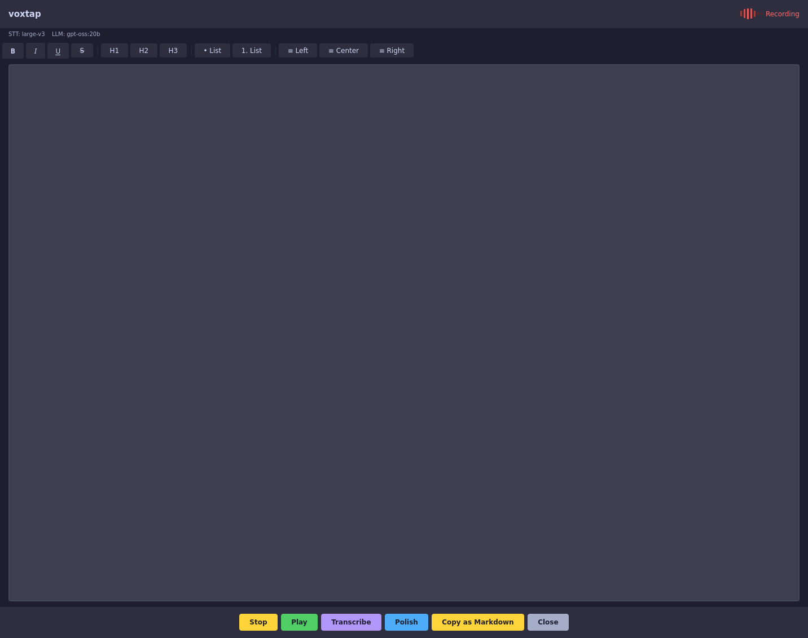
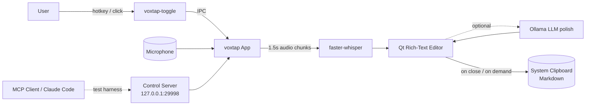

<p align="center">
  
</p>

<p align="center">
  <a href="https://pypi.org/project/voxtap/"></a>
  <a href="https://pypi.org/project/voxtap/"></a>
  <a href="LICENSE"></a>
  
  
</p>

# voxtap

> Tap a key, speak, get text. A fully local speech-to-text desktop app.

**voxtap** is a keyboard-driven dictation tool that runs [faster-whisper](https://github.com/SYSTRAN/faster-whisper) entirely on your machine. No cloud API, no telemetry, no audio ever leaves your device. It ships with a lightweight rich-text editor, optional LLM polishing via [Ollama](https://ollama.com/), and a toggle hotkey that works on Linux (X11 & Wayland), macOS, and Windows.

<p align="center">
  
</p>

## Features

- **100% local** — all transcription and polishing run on your hardware
- **Tap-to-toggle hotkey** — single keybinding starts/stops recording across apps (`voxtap-toggle`)
- **Rich text editor** — bold, italic, underline, headings, lists, alignment; copies as Markdown
- **Live transcription** — audio is buffered and decoded every 1.5 s; text streams in as you speak
- **Optional LLM polish** — cleans filler words and punctuation via a local Ollama model
- **Screenshot paste** — `Ctrl+V` of an image inserts the file path directly
- **Spotify auto-pause** — pauses playback while recording, resumes on stop (Linux)
- **MCP control surface** — the app is scriptable by Claude Code / any MCP client for E2E testing
- **Cross-platform** — Linux (X11 & Wayland), macOS, Windows

## Architecture



Core components:

| Module | Purpose |
|---|---|
| `src/voxtap/app.py` | Qt app, audio capture, Whisper inference, rich-text editor |
| `src/voxtap/toggle.py` | `voxtap-toggle` entry point — launches or toggles a running instance |
| `src/voxtap/control_server.py` | Optional TCP control server for MCP-driven automation |
| `src/voxtap/clipboard.py` | Cross-platform clipboard (xclip / wl-copy / pbcopy / PowerShell) |
| `mcp_server/pyqt_mcp.py` | stdio MCP server exposing `launch_app`, `click`, `get_snapshot`, ... |

## Quick Start

### Install

```bash
pip install voxtap
```

### Run

```bash
voxtap
```

The first run downloads the Whisper model (~1.5 GB for `distil-large-v3`). A progress dialog shows download status; recording starts automatically once the model is loaded.

## System Dependencies

voxtap needs a working audio input, a clipboard utility, and Qt6.

### Linux (Debian / Ubuntu)

```bash
sudo apt install portaudio19-dev xclip
# Wayland users: sudo apt install wl-clipboard
```

### Linux (Fedora)

```bash
sudo dnf install portaudio-devel xclip
```

### Linux (Arch)

```bash
sudo pacman -S portaudio xclip
```

### macOS

```bash
brew install portaudio
# pbcopy ships with macOS — no extra clipboard tool needed
```

### Windows

No extra system dependencies — PortAudio is bundled with `sounddevice`, and clipboard access uses PowerShell.

## Usage

```bash
voxtap                              # Start with defaults (distil-large-v3, English)
voxtap --model small                # Smaller / faster model
voxtap --model large-v3             # Full large model for max accuracy
voxtap --language de                # Transcribe German
voxtap --device cpu                 # Force CPU (skip CUDA auto-detection)
```

### Toggle Keybinding

Bind `voxtap-toggle` to a key in your window manager for quick access. If an instance is already running, it toggles recording on/off; otherwise it launches a new one. See [docs/keybindings.md](docs/keybindings.md) for setup instructions for i3, Sway, Hyprland, GNOME, KDE, Windows, and macOS.

## Configuration

| Flag | Default | Description |
|------|---------|-------------|
| `--model` | `distil-large-v3` | Whisper model (`tiny`, `small`, `medium`, `large-v3`, `distil-large-v3`, ...) |
| `--language` | `en` | Language code (`en`, `de`, `fr`, `es`, ...) |
| `--device` | auto | `cpu`, `cuda`, or `auto` (tries CUDA first) |

### Environment Variables

| Variable | Description |
|---|---|
| `VOXTAP_CONTROL_PORT` | If set, starts the TCP control server on this port (loopback only). Used by the MCP server — do not set in production. |
| `VOXTAP_CONTROL_HOST` | Bind address for the control server. Defaults to `127.0.0.1`. |

## Editor Features

- **Bold** (Ctrl+B), **Italic** (Ctrl+I), **Underline** (Ctrl+U), **Strikethrough** (Ctrl+Shift+S)
- **Headings** (H1, H2, H3)
- **Bullet** and **numbered** lists
- **Text alignment** (left, center, right)
- **Paste image paths** — Ctrl+V with a screenshot inserts the file path
- **Copy as Markdown** — button or automatic on close
- Full undo/redo

## How It Works

1. voxtap opens a Qt window and starts recording from your microphone
2. Audio is buffered and transcribed every 1.5 seconds using faster-whisper
3. Transcribed text is appended to the editor (or replaces the selected text)
4. You can pause recording, edit text freely, then resume
5. If [Ollama](https://ollama.com/) is running locally, transcribed text is polished (filler words removed, punctuation fixed)
6. On close (Escape), the editor content is copied to the clipboard as Markdown
7. Spotify is automatically paused during recording and resumed on stop (Linux)

## LLM Polish (Optional)

voxtap can use a local LLM via [Ollama](https://ollama.com/) to clean up transcriptions — removing filler words, fixing punctuation, correcting repeated words. Entirely optional; transcription works fine without it.

1. Install Ollama: https://ollama.com/download
2. Pull a model:

   ```bash
   ollama pull gpt-oss:20b
   ```

3. Make sure Ollama is running (`ollama serve` or the desktop app), then start voxtap as usual. The status bar shows the active LLM model.

If Ollama is not running or the model is not available, voxtap silently skips the polish step.

## Scripting / Testing (MCP)

voxtap embeds an optional TCP control server that exposes every UI action (click, fill, snapshot, screenshot, toggle recording, set transcript, read state) as JSON commands. A companion MCP server (`mcp_server/pyqt_mcp.py`) wraps this for use with Claude Code or any MCP client — letting an agent drive the app end-to-end without real audio.

```bash
pip install voxtap[mcp]
```

See [docs/testability_via_mcp.md](docs/testability_via_mcp.md) for tool reference, naming conventions, and example flows.

## Project Structure

```
voxtap/
├── src/voxtap/
│   ├── app.py              # Qt app, audio pipeline, Whisper, editor
│   ├── toggle.py           # voxtap-toggle entry point (IPC)
│   ├── control_server.py   # Optional TCP control server (MCP)
│   └── clipboard.py        # Cross-platform clipboard
├── mcp_server/
│   └── pyqt_mcp.py         # stdio MCP server wrapping the control server
├── docs/
│   ├── keybindings.md
│   └── testability_via_mcp.md
├── assets/
│   └── logo.png
└── pyproject.toml
```

## Troubleshooting

| Symptom | Fix |
|---|---|
| `PortAudio library not found` | Install `portaudio19-dev` (Debian), `portaudio-devel` (Fedora), `portaudio` (brew / pacman) |
| `wl-copy / xclip not found` | Install a clipboard utility matching your display server (see System Dependencies) |
| CUDA not detected | Install PyTorch with CUDA support, or run with `--device cpu` |
| Slow on CPU | Use a smaller model: `voxtap --model small` |
| LLM polish not working | Ensure [Ollama](https://ollama.com/) is running and the model is pulled — this feature is optional |

## Contributing

Contributions are welcome! Please open an issue to discuss substantial changes before sending a PR.

1. Fork the repository
2. Create your feature branch (`git checkout -b feature/amazing-feature`)
3. Commit your changes (`git commit -m 'feat: add amazing feature'`)
4. Push to the branch (`git push origin feature/amazing-feature`)
5. Open a Pull Request

## License

[MIT](LICENSE) © Lukas Kellerstein
